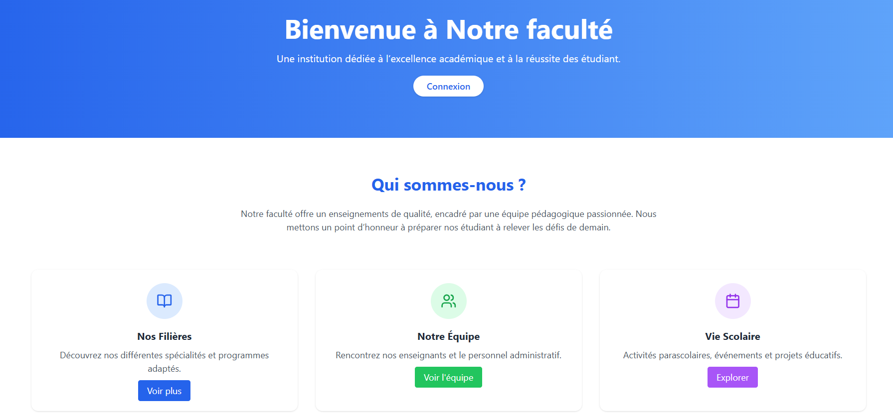
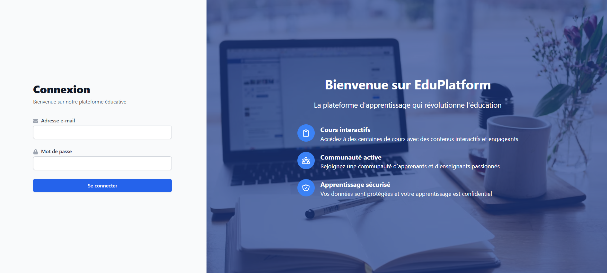
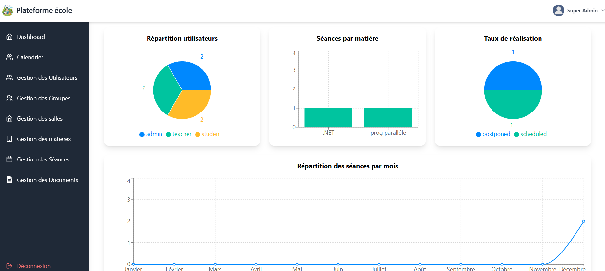
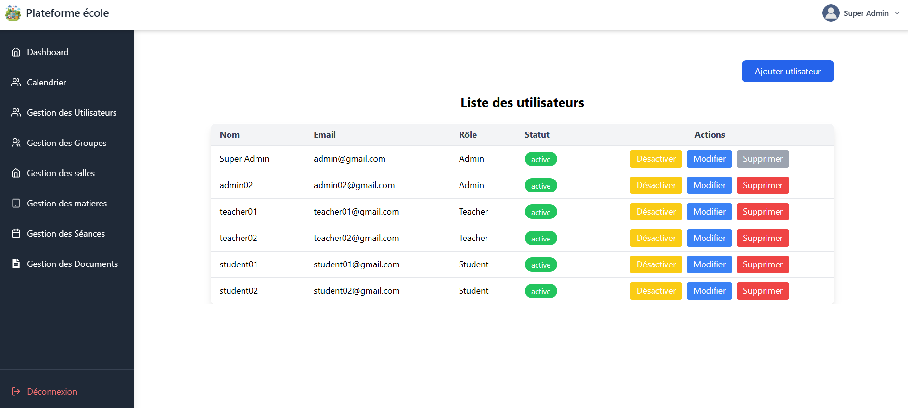
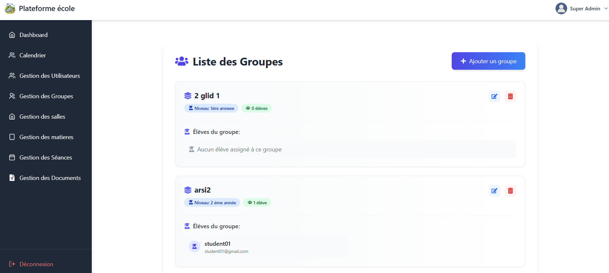
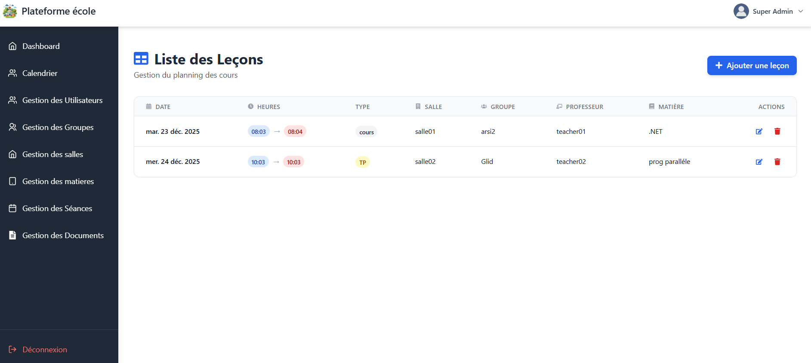
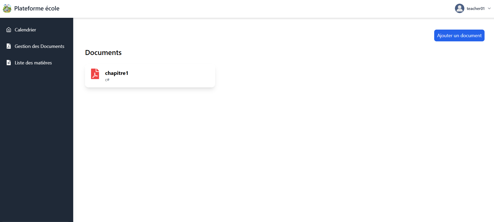

## 🎥 Video Demo

A complete walkthrough of **SchoolManagementMERN**, demonstrating the main workflows available to administrators, teachers, and students.

The demo includes:

- JWT authentication and role-based access
- Admin dashboard and statistics
- User and role management
- Student group management
- Academic session scheduling
- Teacher document management
- Student calendar and course resources

▶️ **[Watch the full demo on Google Drive](https://drive.google.com/file/d/1Uy4cN5VlgvYhHsBc-llL0Ot4zzAh-6TL/view?usp=sharing)**

---

## Application Preview

SchoolManagementMERN provides dedicated interfaces for **Administrators, Teachers, and Students**, with role-based access to academic planning, user management, educational resources, and scheduling features.

---

### 🏫 Landing Page

Public entry point introducing the educational platform and providing access to the authentication system.

---

### 🔐 Authentication

JWT-based authentication interface shared by the three application roles:

- Administrator
- Teacher
- Student

After authentication, users are redirected to an interface adapted to their assigned role.

---

### 📊 Admin Dashboard

The administrator dashboard provides a centralized overview of school activity through visual statistics and charts.

It includes information such as:

- User distribution by role
- Sessions by subject
- Session status overview
- Monthly session activity

---

### 👥 User & Role Management

Administrators can manage platform accounts from a centralized interface.

The application supports three roles:

- **Admin**
- **Teacher**
- **Student**

Administrators can create, update, activate/deactivate, and manage user accounts.

---

### 🎓 Group Management

Administrators can create and manage student groups and organize student assignments.

Each group can contain information such as:

- Academic level
- Assigned students
- Group membership

---

### 📅 Academic Session Management

The scheduling interface allows administrators to organize teaching sessions by associating:

- Subject
- Teacher
- Student group
- Classroom
- Date
- Start and end time
- Session type

This module supports centralized academic planning and timetable management.

---

### 📄 Teacher Document Management

Teachers have a dedicated interface for managing educational resources associated with their assigned subjects.

They can publish course documents that students can later access from their own interface.

---

## Role-Based Experience

The platform adapts its navigation and available features according to the authenticated user's role:

| Role | Main Capabilities |
|---|---|
| **Administrator** | Users, groups, rooms, subjects, sessions, documents, dashboard and global calendar |
| **Teacher** | Personal calendar, assigned subjects and educational document management |
| **Student** | Personal calendar, enrolled subjects and access to course documents |
