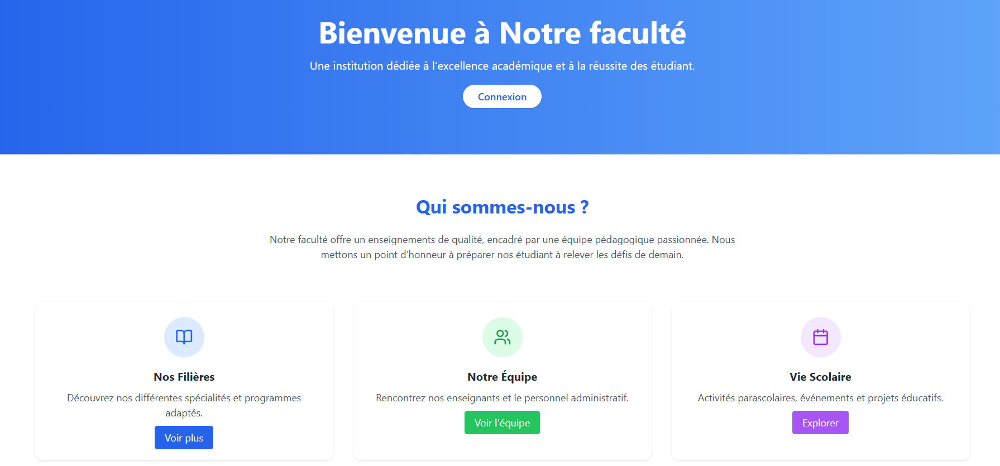
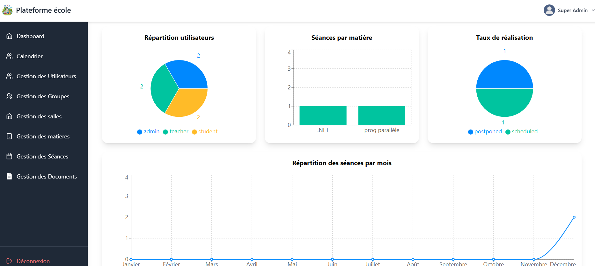
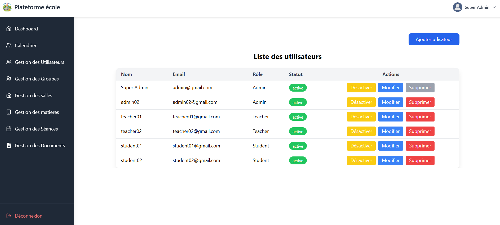
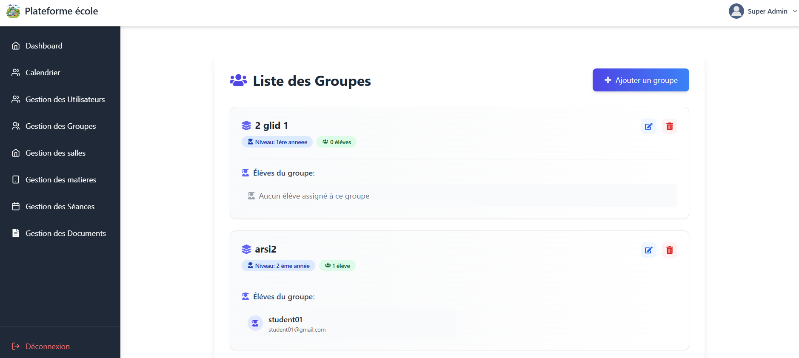
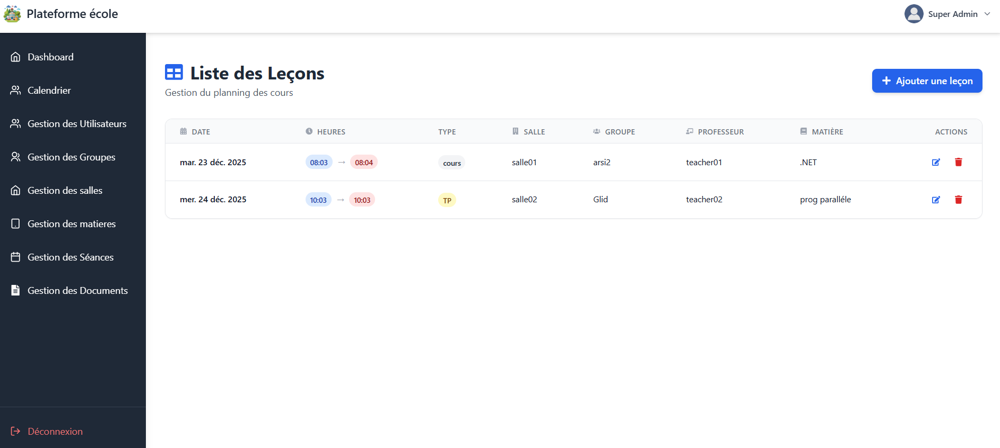
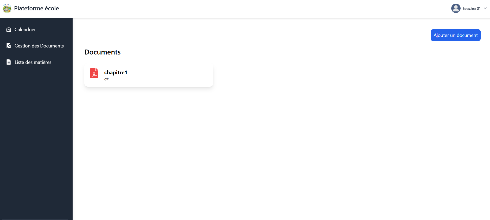

# SchoolManagementMERN 🎓

<p align="center">
  
  
  
  
  
  <a href="LICENSE"></a>
</p>

<p align="center"><strong>A role-based academic management platform for administrators, teachers, and students.</strong></p>

<p align="center"><a href="#key-features">Features</a> · <a href="#architecture">Architecture</a> · <a href="#installation">Installation</a> · <a href="#-video-demo">Demo</a></p>

---

## Project Overview

SchoolManagementMERN is a full-stack school management platform that centralizes academic planning, user administration, educational resources, and role-specific dashboards. It provides dedicated experiences for administrators, teachers, and students while enforcing authenticated, role-based access to protected features.

The project demonstrates the implementation of a complete MERN application, from MongoDB data modeling and Express REST APIs to a responsive React interface with persistent authentication state, calendars, dashboards, and document management.

## Key Features

### Administration

- Dashboard with academic statistics and visual indicators
- User lifecycle and role management
- Student group, subject, classroom, and session management
- Centralized academic calendar and scheduling
- Account activation and deactivation

### Teacher Experience

- Personal teaching calendar
- Assigned subject visibility
- Educational document upload and management
- Access restricted to teacher-specific workflows

### Student Experience

- Personal course calendar
- Enrolled subject visibility
- Access to educational resources and documents
- Navigation adapted to the student role

### Platform Capabilities

- JWT authentication and protected routes
- Role-based access control for Admin, Teacher, and Student
- Document uploads with Multer
- Persistent client state with Redux Persist
- Interactive calendars and dashboard charts
- RESTful communication between React and Express

## Technology Stack

| Layer | Technologies |
|---|---|
| **Frontend** | React 19, Vite, React Router, Redux Toolkit, Chakra UI, Recharts |
| **Backend** | Node.js, Express 5, Mongoose |
| **Database** | MongoDB |
| **Security** | JWT, bcrypt, role-based authorization middleware |
| **Files & Communication** | Multer, Nodemailer, PDF Parse |
| **Developer Experience** | Nodemon, ESLint, Concurrently |

## Architecture

```text
React + Redux frontend (port 5173)
              │
              │ HTTP / JSON
              ▼
Express REST API (port 3000)
              │
       ┌──────┴──────┐
       ▼             ▼
 MongoDB          Uploads
 users, groups,   course files
 sessions, docs
```

The backend follows a modular organization based on routes, controllers, services, models, and middleware. The frontend separates pages, reusable components, layouts, routing, and Redux state.

## Main API Areas

| API prefix | Responsibility |
|---|---|
| `/api/auth` | Registration, login, and authentication |
| `/api/users` | User and role management |
| `/api/group` | Student group management |
| `/api/matiere` | Subject management |
| `/api/salle` | Classroom management |
| `/api/lesson` | Academic session scheduling |
| `/api/documents` | Educational document management |

## Project Structure

```text
SchoolManagementMERN/
├── backend/
│   ├── controllers/
│   ├── middlewares/
│   ├── models/
│   ├── routes/
│   ├── scripts/
│   ├── services/
│   ├── uploads/
│   └── index.js
├── frontend/
│   ├── src/
│   │   ├── composants/
│   │   ├── layout/
│   │   ├── pages/
│   │   └── routes/
│   └── package.json
└── README.md
```

## Data Model

| MongoDB model | Main responsibility | Key relationships |
|---|---|---|
| `utilisateur` | User identity, contact information, role, and account status | Referenced by lessons and documents |
| `group` | Student group and academic level | Contains student references |
| `matiere` | Subject, coefficient, semester, and description | Referenced by lessons and documents |
| `salle` | Classroom definition | Referenced by lessons |
| `lesson` | Scheduled academic session, time, type, and status | Links teacher, group, subject, and room |
| `document` | Course resource metadata and uploaded file | Links subject and teacher |

The user model supports `admin`, `teacher`, and `student` roles as well as active or inactive account status. Lessons support scheduled, cancelled, completed, and postponed states.

## Authentication Workflow

```text
Registration
   │
   ├── Check whether the email already exists
   ├── Hash the password with bcrypt
   └── Store the new MongoDB user

Login
   │
   ├── Find the account by email
   ├── Compare the password hash
   ├── Reject inactive accounts
   └── Sign a JWT containing user ID, role, and email

Protected request
   │
   ├── Read the Bearer token
   ├── Verify and decode the JWT
   ├── Attach the decoded user to the request
   └── Apply role authorization middleware
```

On the frontend, Redux Toolkit stores the authenticated user and token. Redux Persist keeps the authentication state across browser reloads, while protected React routes restrict access according to the active role.

## Security Status

Security controls currently present:

- Password hashing with bcrypt
- JWT-based API authentication
- Role middleware for Admin, Teacher, and Student access
- Account-status checks during login
- Protected React routes
- Restricted file types and upload handling through Multer routes

Important hardening work remains before production use:

- The JWT signing secret is currently hard-coded and must be moved to an environment variable.
- The MongoDB connection string, API URL, frontend origin, and ports are hard-coded for local development.
- JWT expiration is not explicitly configured.
- Registration must prevent public clients from assigning privileged roles.
- Authentication failures should use consistent HTTP status codes.
- Input validation, rate limiting, security headers, and centralized error handling should be added.
- Uploaded documents require stronger validation, access control, storage isolation, and malware scanning.

## Environment Configuration Status

The repository does not currently consume a `.env` file consistently. The active local values are embedded in the backend and frontend source code. A future configuration layer should use variables similar to:

```dotenv
PORT=3000
MONGODB_URI=mongodb://localhost:27017/projet
JWT_SECRET=replace_with_a_long_random_secret
JWT_EXPIRES_IN=8h
FRONTEND_URL=http://localhost:5173
VITE_API_URL=http://localhost:3000/api
```

This block documents the intended secure configuration; adding the file alone will not change runtime behavior until the source code reads these variables through `process.env` and `import.meta.env`.

## Testing Strategy

No automated test suite is currently present. The following test layers are recommended:

| Layer | Recommended coverage |
|---|---|
| **Backend unit tests** | Authentication services, role decisions, scheduling rules |
| **API integration tests** | Auth, users, groups, subjects, rooms, lessons, documents |
| **Database tests** | Mongoose validation and model relationships |
| **Frontend component tests** | Forms, dashboards, calendars, protected navigation |
| **End-to-end tests** | Admin setup, teacher upload, student document access |

Suggested tooling includes Jest, Supertest, MongoDB Memory Server, React Testing Library, and Playwright or Cypress. These are recommendations and are not currently installed as a complete test stack.

## Current Limitations

- Configuration and security secrets are embedded in source files.
- MongoDB and API addresses are fixed to local development values.
- Automated tests and CI checks are not yet available.
- Uploaded documents are stored on the local filesystem.
- The repository does not include Docker or a reproducible MongoDB environment.
- API documentation is not generated through Swagger/OpenAPI.
- Validation and error responses are not yet standardized across all routes.
- Production logging, monitoring, backups, and audit trails are not included.

## Roadmap

- Externalize secrets, database URLs, ports, CORS origins, and frontend API URLs
- Add request validation and centralized error handling
- Add token expiration, refresh strategy, rate limiting, and security headers
- Introduce backend, frontend, and end-to-end automated tests
- Add Swagger/OpenAPI documentation
- Add Docker Compose for MongoDB, API, and frontend
- Move document uploads to managed object storage
- Add GitHub Actions for linting, tests, builds, and secret scanning
- Add production logging, audit trails, monitoring, and backup guidance

## 🎥 Video Demo

A complete walkthrough of **SchoolManagementMERN**, demonstrating the main workflows available to administrators, teachers, and students.

The demo includes:

- JWT authentication and role-based access
- Admin dashboard and statistics
- User and role management
- Student group management
- Academic session scheduling
- Teacher document management
- Student calendar and course resources

▶️ **[Watch the full demo on Google Drive](https://drive.google.com/file/d/1Uy4cN5VlgvYhHsBc-llL0Ot4zzAh-6TL/view?usp=sharing)**

---

## Application Preview

SchoolManagementMERN provides dedicated interfaces for **Administrators, Teachers, and Students**, with role-based access to academic planning, user management, educational resources, and scheduling features.

---

### 🏫 Landing Page

Public entry point introducing the educational platform and providing access to the authentication system.



---

### 🔐 Authentication

JWT-based authentication interface shared by the three application roles:

- Administrator
- Teacher
- Student

After authentication, users are redirected to an interface adapted to their assigned role.


---

### 📊 Admin Dashboard

The administrator dashboard provides a centralized overview of school activity through visual statistics and charts.

It includes information such as:

- User distribution by role
- Sessions by subject
- Session status overview
- Monthly session activity



---

### 👥 User & Role Management

Administrators can manage platform accounts from a centralized interface.

The application supports three roles:

- **Admin**
- **Teacher**
- **Student**

Administrators can create, update, activate/deactivate, and manage user accounts.



---

### 🎓 Group Management

Administrators can create and manage student groups and organize student assignments.

Each group can contain information such as:

- Academic level
- Assigned students
- Group membership



---

### 📅 Academic Session Management

The scheduling interface allows administrators to organize teaching sessions by associating:

- Subject
- Teacher
- Student group
- Classroom
- Date
- Start and end time
- Session type

This module supports centralized academic planning and timetable management.



---

### 📄 Teacher Document Management

Teachers have a dedicated interface for managing educational resources associated with their assigned subjects.

They can publish course documents that students can later access from their own interface.



---

## Role-Based Experience

The platform adapts its navigation and available features according to the authenticated user's role:

| Role | Main Capabilities |
|---|---|
| **Administrator** | Users, groups, rooms, subjects, sessions, documents, dashboard and global calendar |
| **Teacher** | Personal calendar, assigned subjects and educational document management |
| **Student** | Personal calendar, enrolled subjects and access to course documents |

---

## Installation

### Prerequisites

- Node.js 20 or later and npm
- MongoDB Community Server running locally on port `27017`

### 1. Clone the repository

```bash
git clone https://github.com/bassem2002/SchoolManagementMERN.git
cd SchoolManagementMERN
```

### 2. Install dependencies

```bash
cd backend
npm install

cd ../frontend
npm install
```

### 3. Start MongoDB

Make sure MongoDB is running locally. The current backend connects to:

```text
mongodb://localhost:27017/projet
```

### 4. Run the application

From the `backend` directory, start both the Express API and the Vite frontend:

```bash
npm start
```

Alternatively, run them in separate terminals:

```bash
# Terminal 1
cd backend
npm run backend

# Terminal 2
cd frontend
npm run dev
```

- Frontend: `http://localhost:5173`
- Backend API: `http://localhost:3000`

The backend checks for the initial administrator account during startup. Review `backend/scripts/ajouterAdmin.js` before first use and replace any development credentials with secure local values.
